# 💳 QUICKYPAY Mobile App  

**Author:** Serge Benit   Id:27311
**Institution:** AUCA  
**Platform:** Android (Java + Firebase)  

---

## 🚀 Overview  
**QuickyPay** is a user-friendly mobile payment app that allows users to **register, log in, and manage their accounts** securely.  
Built using **Firebase Realtime Database** and **Firebase Authentication**, it ensures smooth, reliable data operations.  

This version introduces major UI and feature upgrades such as enhanced dashboards, user management, and implicit intents for calling and emailing.

---

## 🆕 New Features (2025 Update)

### 🔹 User Dashboard Enhancements  
- Redesigned layout with real-time user data display.  
- Added quick-action buttons for managing accounts.  
- Improved UI consistency across screens.  

📸 **Screenshot:**  
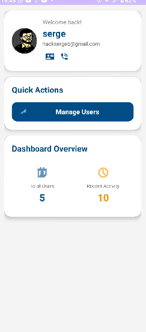

---

### 🔹 User Management (Admin Feature)  
- Admins can view all registered users.  
- Added secure **delete user** functionality via Firebase.  
- Displays success messages upon user deletion.  

📸 **Screenshots:**  
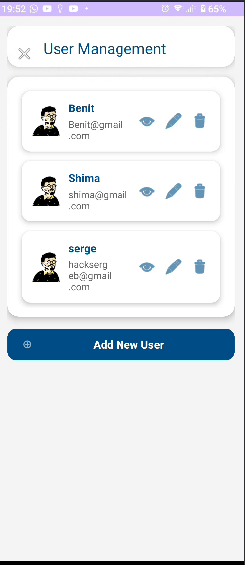  
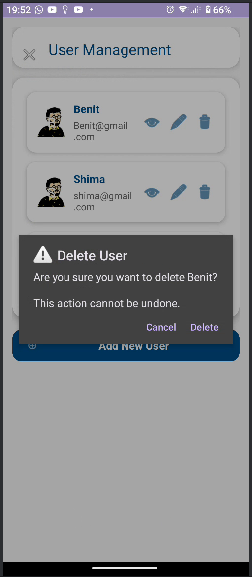  
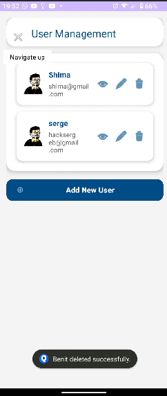

---

### 🔹 Implicit Intents Integration  
- Added **Call Intent** for direct contact with users or support.  
- Added **Mail Intent** to send feedback directly through the app.  

📸 **Screenshots:**  
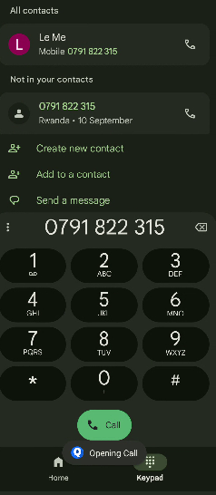  
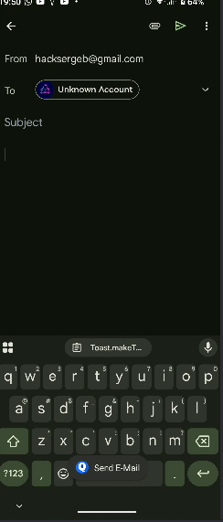

---

### 🔹 Firebase Database Integration  
- Stores all user information in **Firebase Realtime Database**.  
- Smooth, real-time updates for registration and management.  

📸 **Screenshot:**  
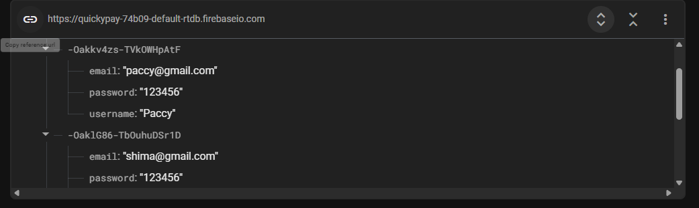

---

### 🔹 Demo and APK  
- 📦 **[Download APK](QuickyPay.apk)**  
- 🎬 **Watch Demo Video Below:**  

<video width="600" controls>
  <source src="demo.mp4" type="video/mp4">
  Your browser does not support the video tag.
</video>

---

## 📲 Main Screens & Flow

### 🟣 Splash Screen  
Welcomes users with a clean intro animation.  
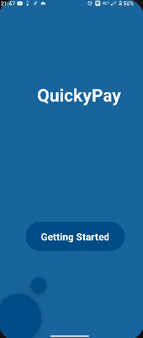

---

### 🟢 App Installed Confirmation  
Displays after successful installation.  
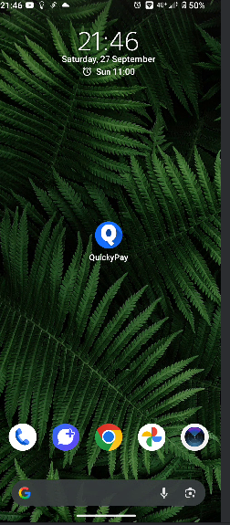

---

### 🟡 Registration Screen  
Allows new users to sign up securely with form validation.  
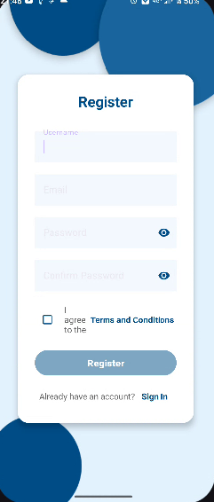

---

### 🔵 Login Screen  
Firebase authentication with input validation and feedback.  
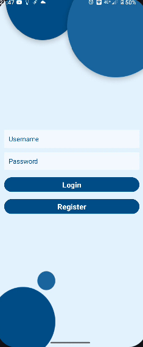

---

### 🟠 Dashboard  
Shows user profile info, balance summary, and quick links.  

---

## 🧠 Tech Stack
- **Language:** Java (Android Studio)  
- **Database:** Firebase Realtime Database  
- **Authentication:** Firebase Auth  
- **UI Design:** XML (Material Design Components)  
- **Demo:** MP4 (Video Preview)

---

## ⚙️ Future Improvements
- Add payment history tracking.  
- Introduce dark mode.  
- Implement push notifications for successful payments.  

---

## 👨‍💻 Author
**Serge Benit**  
Mobile Developer & Instructor – AUCA  
📧 *(Optional: add your contact email here)*  

---
